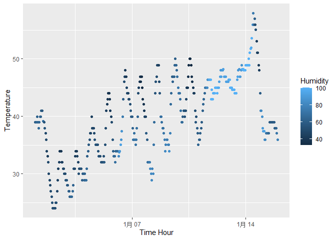

p8105_hw1_yw4251
================
You Wu
2023-09-17

# Problem 1

First, we load package and load `early_january_weather` dataset.

``` r
library(moderndive)
library(tidyverse)
```

    ## ── Attaching core tidyverse packages ──────────────────────── tidyverse 2.0.0 ──
    ## ✔ dplyr     1.1.3     ✔ readr     2.1.4
    ## ✔ forcats   1.0.0     ✔ stringr   1.5.0
    ## ✔ ggplot2   3.4.3     ✔ tibble    3.2.1
    ## ✔ lubridate 1.9.2     ✔ tidyr     1.3.0
    ## ✔ purrr     1.0.2     
    ## ── Conflicts ────────────────────────────────────────── tidyverse_conflicts() ──
    ## ✖ dplyr::filter() masks stats::filter()
    ## ✖ dplyr::lag()    masks stats::lag()
    ## ℹ Use the conflicted package (<http://conflicted.r-lib.org/>) to force all conflicts to become errors

``` r
data("early_january_weather")
early_january_weather
```

    ## # A tibble: 358 × 15
    ##    origin  year month   day  hour  temp  dewp humid wind_dir wind_speed
    ##    <chr>  <int> <int> <int> <int> <dbl> <dbl> <dbl>    <dbl>      <dbl>
    ##  1 EWR     2013     1     1     1  39.0  26.1  59.4      270      10.4 
    ##  2 EWR     2013     1     1     2  39.0  27.0  61.6      250       8.06
    ##  3 EWR     2013     1     1     3  39.0  28.0  64.4      240      11.5 
    ##  4 EWR     2013     1     1     4  39.9  28.0  62.2      250      12.7 
    ##  5 EWR     2013     1     1     5  39.0  28.0  64.4      260      12.7 
    ##  6 EWR     2013     1     1     6  37.9  28.0  67.2      240      11.5 
    ##  7 EWR     2013     1     1     7  39.0  28.0  64.4      240      15.0 
    ##  8 EWR     2013     1     1     8  39.9  28.0  62.2      250      10.4 
    ##  9 EWR     2013     1     1     9  39.9  28.0  62.2      260      15.0 
    ## 10 EWR     2013     1     1    10  41    28.0  59.6      260      13.8 
    ## # ℹ 348 more rows
    ## # ℹ 5 more variables: wind_gust <dbl>, precip <dbl>, pressure <dbl>,
    ## #   visib <dbl>, time_hour <dttm>

``` r
help(early_january_weather)
```

## Early January hourly weather data

**Description**

Hourly meterological data for LGA, JFK and EWR for the month of January
2013. This is a subset of the weather data frame from nycflights13. A
data frame of 358 rows representing hourly measurements and 15
variables.

**Variables**

***origin:*** Weather station. Named *origin* to facilitate merging with
nycflights13::flights data.

***year, month, day, hour:*** Time of recording.

***temp, dewp:*** Temperature and dewpoint in F.

***humid:*** Relative humidity.

***wind_dir, wind_speed, wind_gust:*** Wind direction (in degrees),
speed and gust speed (in mph).

***precip:*** Precipitation, in inches.

***pressure:*** Sea level pressure in millibars.

***visib:*** Visibility in miles.

***time_hour:*** Date and hour of the recording as a POSIXct date.

I could calculate the `mean of temperature`. The mean is 39.5821 F.

## Scatterplot

``` r
scatterplot <- ggplot(early_january_weather, aes(x = time_hour, y = temp, color = humid)) +
  geom_point() +
  labs(
    x = "Time Hour",
    y = "Temperature",
    color = "Humidity"
  )
scatterplot
```

<!-- -->

``` r
ggsave('scatterplot.png',plot=scatterplot)
```

    ## Saving 7 x 5 in image

# Problem 2

Create the dataframe.

``` r
la_df=
  tibble(
    num_samp=rnorm(10),
    log_vecc=num_samp>0,
    char_vecc=letters[1:10],
    fact_vecc = as.factor(rep(1:3, length.out=10))
  )
la_df
```

    ## # A tibble: 10 × 4
    ##    num_samp log_vecc char_vecc fact_vecc
    ##       <dbl> <lgl>    <chr>     <fct>    
    ##  1   -1.03  FALSE    a         1        
    ##  2   -0.586 FALSE    b         2        
    ##  3   -0.855 FALSE    c         3        
    ##  4   -1.17  FALSE    d         1        
    ##  5    0.282 TRUE     e         2        
    ##  6   -1.46  FALSE    f         3        
    ##  7    1.36  TRUE     g         1        
    ##  8   -0.593 FALSE    h         2        
    ##  9    1.09  TRUE     i         3        
    ## 10    0.149 TRUE     j         1

Now, calculate the mean of each variable. I find that only the
`numerical mean` and `vector mean` work.

``` r
num_mean=mean(pull(la_df,num_samp))
log_mean=mean(pull(la_df,log_vecc))
char_mean=mean(pull(la_df,char_vecc))
```

    ## Warning in mean.default(pull(la_df, char_vecc)): argument is not numeric or
    ## logical: returning NA

``` r
fact_mean=mean(pull(la_df,fact_vecc))
```

    ## Warning in mean.default(pull(la_df, fact_vecc)): argument is not numeric or
    ## logical: returning NA

Convert the vector to numerical.

log_num=as.numeric(pull(la_df,log_vecc))
char_num=as.numeric(pull(la_df,char_vecc))
fact_num=as.numeric(pull(la_df,fact_vecc))
